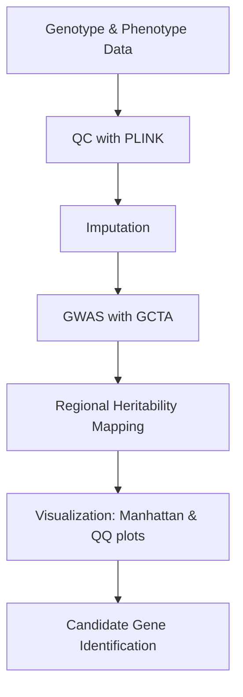

# 🐑 Sheep GWAS Pipeline

This repository contains scripts for conducting **Genome-Wide Association Studies (GWAS)** in sheep. The workflow covers genotype data preparation, quality control, imputation, association testing, regional heritability mapping, and visualization of results.

---

## 📁 Repository Contents

| File | Description |
|------|-------------|
| `1.copy_ids.sh` | Copies sample IDs and prepares metadata for downstream steps |
| `2.clean_files.sh` | Cleans and formats genotype/phenotype input files |
| `3.generate_filenames_for_run.sh` | Generates standardized filenames for pipeline runs |
| `4.Plink_QC.sh` | Performs SNP and sample quality control using **PLINK** |
| `5.imputation_and_gcta_gwas.sh` | Runs genotype imputation and GWAS using **GCTA** |
| `6.generate_SNPlist.R` | Creates SNP lists for downstream analyses |
| `7.regional_heritability_mapping.sh` | Performs Regional Heritability Mapping (RHM) |
| `8.gwas_plots.R` | Generates Manhattan and QQ plots for GWAS results |
| `9.RHM_Plots.R` | Plots results from Regional Heritability Mapping |

---

## 🔬 Workflow Overview

🚀 Getting Started
## Prerequisites
Install required tools:

PLINK

GCTA

R packages: qqman, data.table, tidyverse

Running the pipeline
Example workflow:

# Step 1: QC
bash 4.Plink_QC.sh

# Step 2: Imputation + GWAS
bash 5.imputation_and_gcta_gwas.sh

# Step 3: Regional Heritability Mapping
bash 7.regional_heritability_mapping.sh

# Step 4: Visualization
Rscript 8.gwas_plots.R results/gwas_results.assoc.txt
Rscript 9.RHM_Plots.R results/rhm_results.txt

📊 Outputs

QC reports: SNP and sample filtering statistics

GWAS results: Association summary tables

Plots: Manhattan plots, QQ plots, RHM plots

Candidate SNP lists: Generated by 6.generate_SNPlist.R

